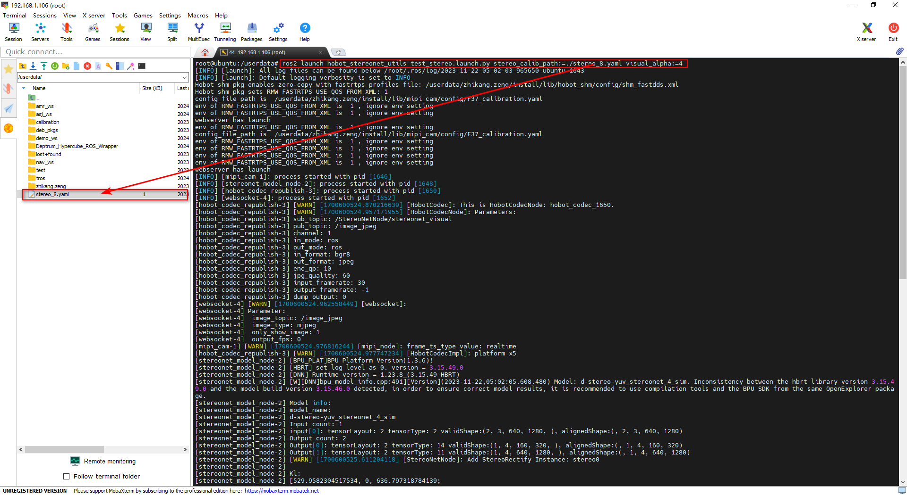

# hobot_stereonet_utils

English| [简体中文](./README_CN.md)

## Description

A binocular auxiliary package that provides functionalities such as acquiring binocular images and depth images, and publishing rectified images.

## Compilation

```shell
# Cross-compilation for X5
bash ./robot_dev_config/build.sh -p X5 -s hobot_stereonet_utils
```

## Running Commands

### 1. Acquire Binocular Images and Depth Images

```shell
# 1. Run the following command in Terminal 1 to start the MIPI binocular camera. You can view the binocular images output by the MIPI camera by entering http://ip:8000. Alternatively, you can use other cameras, but you will need to customize their startup method.
ros2 launch hobot_stereonet_utils test_mipi_cam.launch.py

# 2.1. Run the following command in Terminal 2 to capture binocular images. Press 'Enter' to capture one image. Note that you should create a directory for saving images before saving.
mkdir -p ./data/stereo_imgs
ros2 run hobot_stereonet_utils save_stereo_img --ros-args -p dir:=./data/stereo_imgs

# 2.2. Run the following command in Terminal 2 to capture depth images. Press 'Enter' to capture one image. Note that you should create a directory for saving images before saving.
mkdir -p ./data/depth_imgs
ros2 run hobot_stereonet_utils save_depth_img --ros-args -p dir:=./data/depth_imgs
```

**Running Parameters**

| Name     | Parameter Value                                | Description              |
| -------- | ---------------------------------------------- | ------------------------ |
| save_num | Default: 1                                     | Image save sequence      |
| dir      | Default: Directory for stereo and depth images | Directory to save images |

### 2. Publish Rectified Images

```shell
# Run the following command in Terminal 1 to start the MIPI binocular camera. You can view the binocular images output by the MIPI camera by entering http://ip:8000. Alternatively, you can use other cameras, but you will need to customize their startup method.
# Image resolution: 1280*640
ros2 launch hobot_stereonet_utils test_rectify_mipi_cam.launch.py stereo_calib_path:=stereo_8.yaml
# Image resolution: 1280*960
ros2 launch hobot_stereonet_utils test_rectify_mipi_cam_1280_960.launch.py stereo_calib_path:=stereo_8.yaml
```

**Running Parameters**

| Name              | Parameter Value                | Description           |
| ----------------- | ------------------------------ | --------------------- |
| stereo_calib_path | Default: /config/stereo_8.yaml | Calibration file path |

## Running Results

### 1. Acquire Binocular Images and Depth Images

- Terminal 1 Result


- Terminal 2 Result


### 2. Publish Rectified Images


## Usage Scenarios

### Capture Checkerboard Images for Stereo Calibration

You can use it in conjunction with the [stereo calibration GitHub repository](https://github.com/D-Robotics/stereo_calib.git) to calibrate the binocular camera. After capturing images, input them into the calibration program to obtain calibration results.


### Test Stereo Calibration Results

Copy the `stereo_8.yaml` file generated by the [stereo calibration GitHub repository](https://github.com/D-Robotics/stereo_calib.git) to the X5 board, and then run:

```shell
# Run the following command in Terminal 2 to start the MIPI binocular package. You can view the results by entering http://ip:8000.
ros2 launch hobot_stereonet_utils test_mipi_stereo.launch.py stereo_calib_path:=./stereo_8.yaml visual_alpha:=4
```




