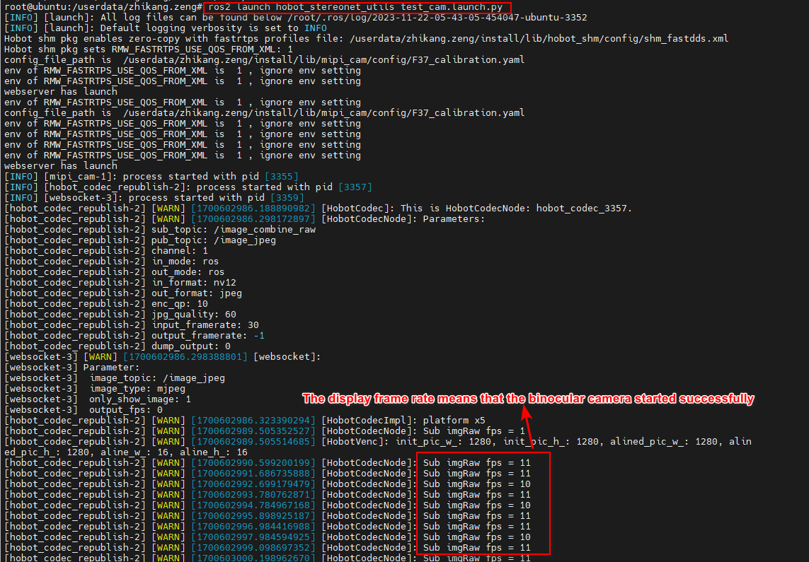
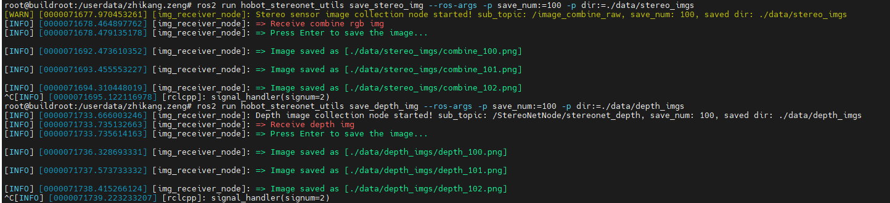
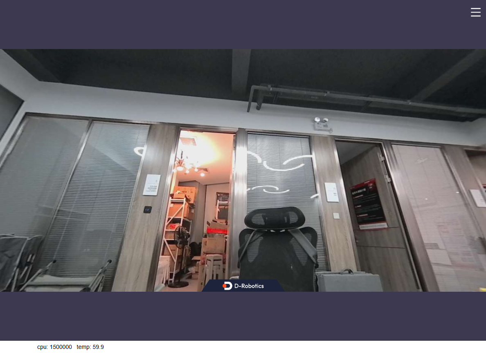
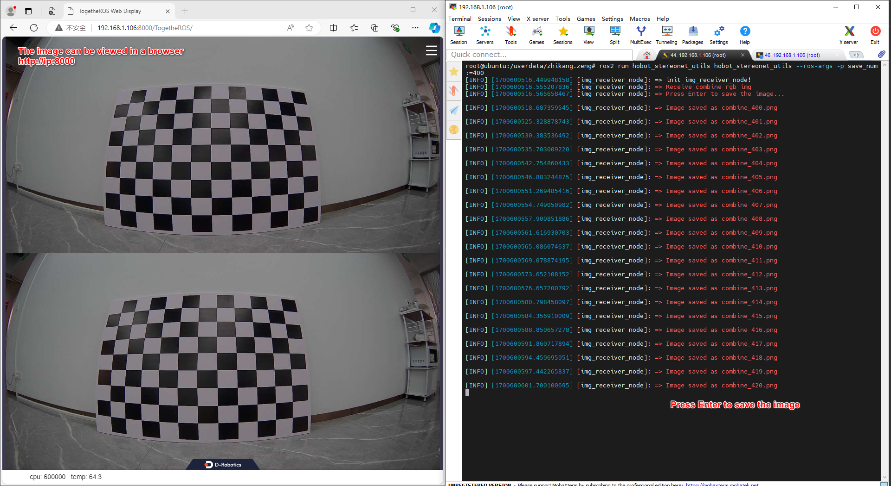
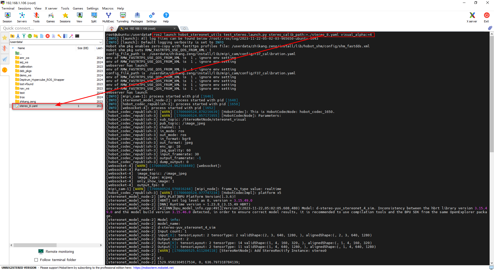
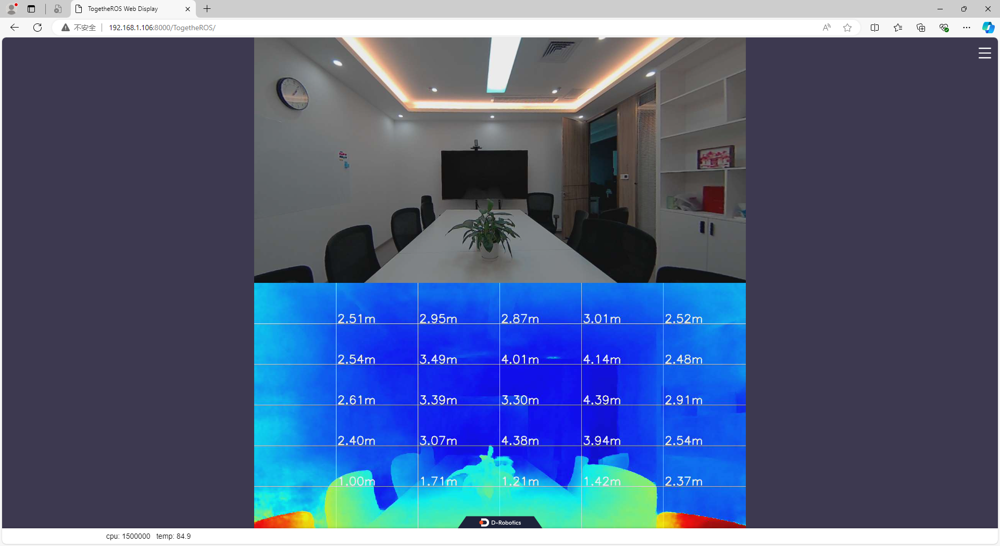

# hobot_stereonet_utils

## 描述

双目辅助功能包，提供对双目图像、深度图像进行采集；发布矫正后图像等功能

## 编译

```shell
# X5交叉编译
bash ./robot_dev_config/build.sh -p X5 -s hobot_stereonet_utils
```

## 运行命令

### 1. 采集双目图像、深度图像

```shell
# 1、在终端1运行以下命令，启动mipi双目相机，输入http://ip:8000可以查看mipi相机输出双目图像，也可以使用其它相机，需要用户自定义其启动方式
ros2 launch hobot_stereonet_utils test_mipi_cam.launch.py

# 2.1、在终端2运行以下命令，可以对双目图像进行采集，按'Enter'键采集一张，注意保存图像前要创建保存目录
mkdir -p ./data/stereo_imgs
ros2 run hobot_stereonet_utils save_stereo_img --ros-args -p dir:=./data/stereo_imgs

# 2.2、在终端2运行以下命令，可以对深度图进行采集，按'Enter'键采集一张，注意保存图像前要创建保存目录
mkdir -p ./data/depth_imgs
ros2 run hobot_stereonet_utils save_depth_img --ros-args -p dir:=./data/depth_imgs
```

**运行参数**

| 名称     | 参数值                       | 说明           |
| -------- | ---------------------------- | -------------- |
| save_num | 默认值：1                    | 保存图像的序号 |
| dir      | 默认值：双目图和深度图的目录 | 保存图像的目录 |

### 2. 发布矫正后图像

```shell
# 在终端1运行以下命令，启动mipi双目相机，输入http://ip:8000可以查看mipi相机输出双目图像，也可以使用其它相机，需要用户自定义其启动方式
# 图像分辨率为1280*640
ros2 launch hobot_stereonet_utils test_rectify_mipi_cam.launch.py stereo_calib_path:=stereo_8.yaml
# 图像分辨率为1280*960
ros2 launch hobot_stereonet_utils test_rectify_mipi_cam_1280_960.launch.py stereo_calib_path:=stereo_8.yaml
```

**运行参数**

| 名称              | 参数值                        | 说明         |
| ----------------- | ----------------------------- | ------------ |
| stereo_calib_path | 默认值：/config/stereo_8.yaml | 标定文件路径 |

## 运行结果

### 1. 采集双目图像、深度图像

- 终端1结果



- 终端2结果



### 2. 发布矫正后图像



## 使用案例

### 采集棋盘格图像进行双目标定

可以配合[双目标定GitHub仓库](https://github.com/D-Robotics/stereo_calib.git)使用，对双目相机进行标定，采集图像后，输入标定程序即可获得标定结果



### 测试双目标定结果

将[双目标定GitHub仓库](https://github.com/D-Robotics/stereo_calib.git)运行结果生成的文件`stereo_8.yaml`文件复制到X5板端，然后运行

```shell
# 在终端2运行以下命令，启动mipi双目功能包，输入http://ip:8000可以查看结果
ros2 launch hobot_stereonet stereonet_model_web_visual_v2.launch.py stereo_calib_path:=./stereo_8.yaml
```



